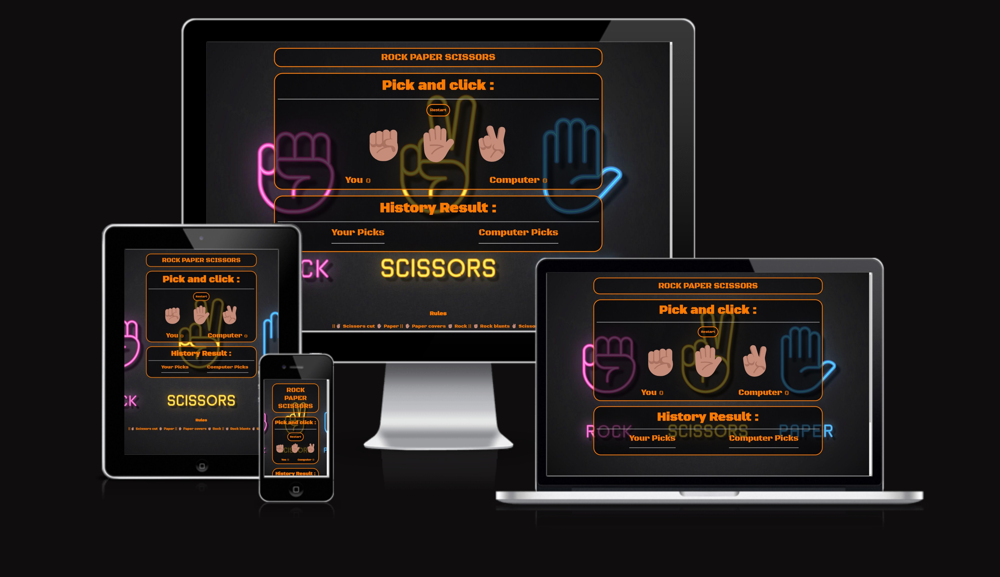

# Rock Paper 

## Goals and Description
Welcome to my Rock-Paper-Scissors Game! 

This is a computer vs player game where, following the rules of the game, the user and computer can score points up to 10, before one or the other wins that round. 

This game is designed to be played by someone who wants to play a simple game and doesn't have the time to play something more complex. Perhaps on portable devices like mobile phones or tablets while commuting to school or work.  It is additionally perfect for younger people, this game is simple enough in complexity that it can be played and enjoyed by anyone. The game has many variations to across the globe, swapping out the names of rock, paper and scissors for other words, or adding complexity by introducing other variables (Such as Rock, Paper, Scissors, Lizard, Spock!). For my game, I've opted to keep the traditional 3 variable rock, paper and scissors!

Beyond testing my Javascript abilities, this website's goal is to make a well-tested and fully functioning basic game that combines functionality with clean design and colours. 

[Visit the website here](https://fbartosz86.github.io/PROJECT2/)

---

## Website across different platforms

---

## UX Description

In this game, vivid colours are very popular and I featured the following:

Colours:
I Orange neon colour dominate the entire design, giving it a unique look
- All text in vivid orange #ff7b00 
- Restart button in  vivid orange #ff7b00 
- Title, Game area and History result area are in a transparent dark background with an Orange border.

Layout:

- Background picture with Rock, Paper and Scissors in neon colours
- Title on the top of the page
- "Game Arena" with restart button, choices buttons and summarised score for player and computer
- History results with player and computer picks
- Rules on the bottom of the page
- Win/Lose Banner following the result

---
## Technologies used

- HTML5 - Used to structure my website
- CSS3 - Used to style my website
- JS - Used to provide logic to my website
- Github - The cloud based service for hosting repositories
- Git - Used to add, commit and push my changes to the server
- Google Fonts - Used to source different fonts in my css file

---
## Website features

### Home-Page
Once the player enter weebstie, the game page will appear.

### About the Game Features

The game features a choices bar with 3 options to select. Rock (Fist emoji 🤜), Paper (Open hand emoji ✋) and Scissors (Peace sign emoji ✌️). Whenever you Pick and Click a choice, it will appear in the history result followed by the computer's random choice and if either player or computer wins points will be added to the scoreboard, if there is a draw the score won't change. 

On the History Results section, not only it will show the last choice, but it will also keep track of previous choices.

After either the Player or the Computer gets to 10 wins there will be an alert message popping up saying who the winner is.

---

## Testing and Validation

### JSHint.com

### Responsiveness Testing (Multi-Platform)

This is a fully responsive website as you can see in the image below and it's suited for all platforms:

I used the Am i Responsive Website to check this.

### Lighthouse Testing

I can confirm that the website passed with great scores. See report below:

Desktop

Mobile

### Validation:

HTML Validation through [HTML-Validator](https://validator.w3.org/)

All "slash on void elements "have been removed and typo Spam elements have been properly renamed to span.

CSS Validation through [CSS-Validator](https://jigsaw.w3.org/css-validator/)

All misspelled errors have been fixed.

---
## Deployment
Below are the steps to take to deploy this website:

Rock Paper Scissors! is deployed on Github (the cloud-based service that is hosting my repository). Follow the steps below to deploy a Github Repository through GitHub pages:

1. Select the repository that you want to deploy and select the settings link at the top right of the menu bar (A 'cog' icon will show near it).
2. Select the pages section on the vertical navigation bar on the left.
3. On the Github pages tab, scroll to the Source area and change the "None" branch tab to "Main", followed by changing the folder selector to "Root".
4. Finally, save this setting and refresh the site until you are presented with the following message in green: "Your site is published at (Your Github web address)"

### Forking your Repository
You can fork your repository to create an exact copy of the original one. This allows you to make changes without altering the original repository. 
Take the steps below:

1. Find and select your chosen repository.
2. At the top right of the page, between the watch/unwatch tab and the star tab, select the "Fork" tab.
3. You should now see a copy of the same repository in your account.

### Cloning a Repository
How to make a local clone repository:

1. Find and select the chosen repository.
2. Click on the "Code" button above the displayed repository files.
3. Select and Copy the displayed link.
4. In Gitpod, change the directory to your desired location.
5. Type "git clone" in the terminal and paste the link, followed by pressing Enter on your keyboard. You have successfully created a clone for local use!

---
## Credits
- [How To Code Rock Paper Scissors In JavaScript by Web Dev Simplified](https://www.youtube.com/watch?v=1yS-JV4fWqY) Helped me understand and build the Javascript, HTML and CSS  main structures of this project.
- [Web Development Tutorial - JavaScript, HTML, CSS - Rock Paper Scissors Game by freeCodeCamp.org ](https://www.youtube.com/watch?v=jaVNP3nIAv0) Helped me to understand better how Javascript work, i havent used any coding from that tutorial.
- [CSS-tricks.com](https://css-tricks.com/perfect-full-page-background-image) Helped me understand how to make "Perfect Full Page Background Image".
- [W3C Markup Validation Service](https://validator.w3.org/)  Used to validate all HTML code written and used in this webpage.
- [W3C CSS Validation Service](https://jigsaw.w3.org/css-validator/#validate_by_input) Used to validate all CSS code written and used in this webpage.
- [AmIResponsive](http://ami.responsivedesign.is/) Used to generate responsive images used in README file.
- [Grammarly](https://www.grammarly.com/) Used to rectify any grammar errors.       
- [Rock Paper Scissors by Robrowno](https://github.com/Robrowno/rock-paper-scissors) inspired me to build my readme  file the way I have done it.
- Background downloaded from [Wallpaperaccess.com](<https://wallpaperaccess.com/rock-paper-scissors>)
- Fonts imported from: [Google Fonts](https://fonts.googleapis.com/css2?family=Black+Ops+One&display=swap)
- Favicon downladed from [Icon by Freepik](https://www.freepik.com/icon/rock-paper-scissors_6729598)
- Many thanks to the Code Institute slack community for support with my questions. 
- A Massive thanks to Mihai Paper for constant motivation and moral support.

---
## Final Thoughts

This project was very challenging for me my understanding of Javascript and for sure  I learned a lot through doing this project.  I am glad that I continued searching for the answers and didn't give up when I faced challenges, I am sure this knowledge will be very useful in my future programming career.